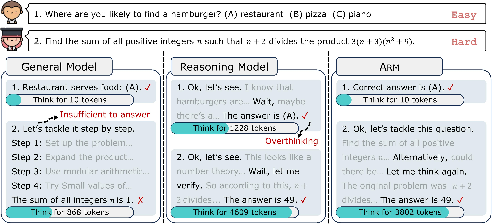

# ARM: Adaptive Reasoning Model
ARM—Adaptive Reasoning Model, a reasoning model capable of adaptively selecting appropriate reasoning formats based on the task at hand.

<p align="center">

</p>

## Environments
This repository contains the codebase for SFT and RL based on [LLaMA-Factory](https://github.com/hiyouga/LLaMA-Factory) and [VeRL](https://github.com/volcengine/verl).
We use two separate conda environments for each stage:
```bash
# SFT
conda env create -f environment/llama_factory_env.yaml
conda activate arm_llama_factory

# RL
conda env create -f environment/verl_env.yaml
conda activate arm_verl
pip3 install --force-reinstall torch==2.4.0 --index-url https://download.pytorch.org/whl/cu124
pip3 install flash-attn --no-build-isolation
````


## Stage1: SFT
```bash
conda activate arm_llama_factory
cd LLaMA-Factory
```
Make sure to specify the correct model path in the `.yaml` file.

### Train
```bash
CUDA_VISIBLE_DEVICES=0,1,2,3 llamafactory-cli train stage1_scripts/qwen2.5_7b/train.yaml
```
### Merge

```bash
llamafactory-cli export stage1_scripts/qwen2.5_7b/merge.yaml
```


## Stage2: RL
```bash
conda activate arm_verl
cd verl
```
Make sure to specify the correct model and data path in the `.sh` file.
### Data Process
```bash
# The training data is located in arm/verl/data/parquet.  
# Alternatively, you can prepare your own training data, e.g.:
python3 stage2_scripts/data_preprocess/gsm8k.py

# You can also prepare data for the instruction-guided mode used in evaluation, e.g.:
python3 stage2_scripts/data_preprocess/instruction_guided/gsm8k.py
```

### Train
```bash
bash stage2_scripts/trainer/run.sh
```

### Generate
```bash
# Adaptive Mode
bash stage2_scripts/generation/adaptive_run.sh

# Instruction-Guided Mode. Specify the reasoning format in the .sh file:
bash stage2_scripts/generation/instruction_guided_run.sh
```

### Evaluate
```bash
bash stage2_scripts/evaluation/run.sh
```